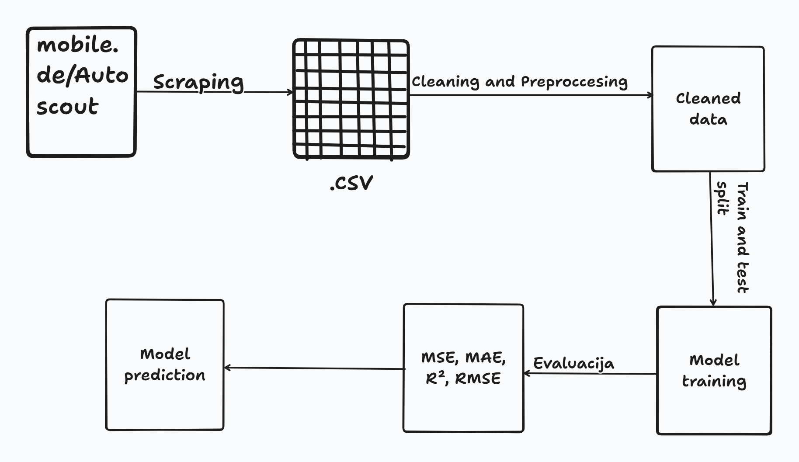

# Used Cars Price Prediction using Machine Learning

## Introduction
The used car market is highly dynamic, vehicle prices fluctuate depending on various factors such as brand, model, production year, mileage, fuel type, and market demand.  
Estimating the fair value of a used car manually can be challenging and subjective.
The goal of this project is to develop a **machine learning model** capable of **predicting the price of a used car** based on its characteristics.  
Such a model can help buyers and sellers make data-driven decisions and improve price transparency in the automotive market.

## Hypothesis
The price of a used car can be accurately predicted using a machine learning model trained on real-world vehicle listings.

## Dataset
The dataset used in this project is collected via web scraping from major car listing platforms:
- [mobile.de](https://www.mobile.de)
- [AutoScout24](https://www.autoscout24.com)

Each record in the dataset represents one used car listing with the following attributes:

| Attribute | Description |
|------------|-------------|
| `brand` | Car brand (e.g., BMW, Audi, Volkswagen) |
| `model` | Specific car model |
| `year` | Year of manufacture |
| `mileage` | Number of kilometers driven |
| `fuel_type` | Type of fuel (petrol, diesel, electric, hybrid) |
| `transmission` | Type of transmission (manual, automatic) |
| `power_hp` | Engine power in horsepower |
| `price` | Car price (target variable) |

## Methodology

