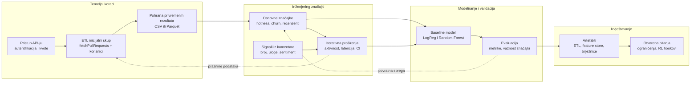

Plan projekta: Vrijeme do GitHub PR mergea
=========================================

Uvod
----
Gradimo reproducibilan pipeline koji procjenjuje za koliko će otvoreni GitHub pull request biti mergan. Fokus ostaje na Node.js repozitorijima kako bismo imali dovoljno bogat, ali kontroliran uzorak. Prvi ciklus rada služi za provjeru izvedivosti na malom broju PR-ova i održavanje jasne evidencije koraka.

Problem i hipoteza
------------------
Procjenjujemo vrijeme do mergea iz skupa metapodataka (aktivnost autora, traženi recenzenti, testovi) i signalâ tijeka rada (latencija događaja, rezultati CI-ja). Polazna hipoteza je da kombinacija hotnessa i churn-a već daje dobar temelj za regresijski model, dok bi dodatni signali postupno trebali smanjivati pogrešku procjene.

Podaci i način prikupljanja
---------------------------
- GitHub API koristimo uz vlastite vjerodajnice i najprije provjeravamo dostupne kvote.
- Reproduciramo pojednostavljenu Sophilabs ETL skriptu (`fetchPullRequests`, `fetchUserInfo`, lagani `computeHotness`) nad podskupom do 1 000 PR-ova, uz prikupljanje vremenskih oznaka kreiranja i mergea.
- Međurezultate privremeno čuvamo kao CSV/Parquet zapise prije odluke o trajnom skladištu (npr. MongoDB).

Inženjering značajki
--------------------
- Početni paket: `log_hotness`, `log_churn`, `has_tests`, `requested_reviewers`, `description_length`, `initial_latency_hours`.
- Proširenja u valovima: aktivnost autora kroz vrijeme, latencija recenzije, rezultati CI-ja, broj i sentiment komentara, omjeri dodanih/obrisanih linija.
- Svako proširenje dokumentiramo i provjeravamo utjecaj na postojeću train/test podjelu te distribuciju ciljne varijable (vrijeme do mergea u satima ili danima).

Modeliranje i evaluacija
------------------------
- Početni baseline čine linearna regresija i Random Forest Regressor; nakon stabilizacije pipelinea razmatramo Gradient Boosting i vremenski svjesne modele.
- Pratimo MAE, RMSE i R² te pregledavamo rezidualne grafove i važnost značajki.
- Rješavamo ekstremne outliere robusnim skaliranjem ili log-transformacijom ciljne varijable, uz opciju kvantilne regresije za bolje hvatanje repova distribucije.

Izvještavanje i artefakti
-------------------------
- Pripremamo skup ETL skripti, bazu značajki i bilježnice s baseline modelima i analizom pogrešaka.
- Izvodimo kratke ablacije uklanjanjem pojedinih značajki kako bismo razumjeli njihov doprinos.
- Završni sažetak dokumentira ograničenja (rate limit, promjene API-ja) i predlaže načine ublažavanja poput nastavka ETL-a i balansiranih funkcija gubitka.

Planirani dijagram toka
-----------------------

Isporuke
--------
- Dokumentirane ETL skripte i baza značajki za odabrane Node.js PR-ove.
- Bilježnice s baseline modelima, metrikama train/test raspodjele i kratkom analizom pogrešaka.
- Opcionalna istraživačka bilježnica za signale iz komentara i buduće eksperimente s pojačanim učenjem.
- Tehnički sažetak koji objašnjava pipeline, ključne uvide i otvorene teme za sljedeći iterativni ciklus.

