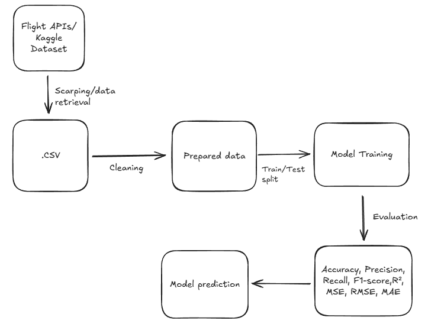

# Flight Delay Prediction - Marul Babic

**Project:** Flight Delay Prediction **Student:** Marul Babic**Status:** In Progress

## Project Overview
Air traffic is one of the most complex systems in modern society. Every day, thousands of flights operate worldwide, and delays are one of the biggest challenges for airlines, passengers, and airports.
Delays lead to additional costs, damage company reputation, and can affect safety and flight scheduling.

The goal of this project is to develop a model that predicts whether a flight will be delayed based on historical flight data and the conditions under which flights took place.
The model will use linear and logistic regression and analyze the impact of various factors such as:

- Departure and arrival airports
- Scheduled departure time
- Airline
- Day of the week
- Weather conditions

## Hypothesis
The duration of flight delays can be estimated using a machine learning model that analyzes historical flight schedules, airport traffic, and weather conditions.

## Dataset

- Flight delay dataset [https://www.kaggle.com/datasets/sriharshaeedala/airline-delay?]

## Student Information

- **Student Name:** Marul Babic
- **GitHub:** @MarulBabic

## Technologies used

- Language: Phyton
- Libraries: pandas,datetime,scikit-learn

## Diagram

